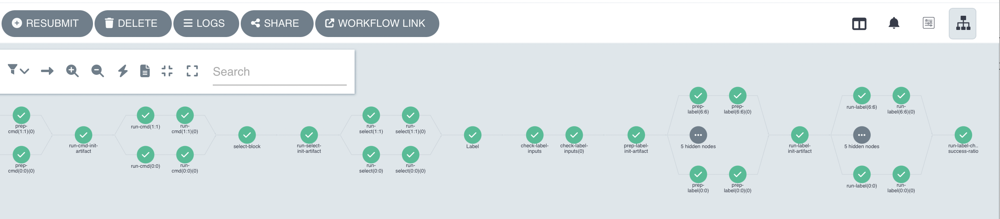

# Table of contents
- [About pflow](#about-pflow)
- [Quick Start](#quick-start)
- [Main procedure of Pflow](#main-procedure-of-pflow)

# About pflow
Pflow is a python package written to generate data for training generative models of proteins using molecular dynamics. 

# Quick start
Pflow is based on [dflow](https://github.com/deepmodeling/dflow), tt is recommended to use k8s enviroment to run the workflow unless it is not doable anyway. The dflow team provide a community version of k8s [deepmodeling k8s](https://workflows.deepmodeling.com/), making the use of pflow very convenient. To use the community version of k8s, one first need to register a Bohrium account in [Bohrium](https://bohrium.dp.tech/login) and learn a few concepts (job, jobgroup, project id) in the Bohrium website documents. Then the use of pflow is very easy.

## Set the enviroment variables
Just set the enviroment variables based on your personal Bohrium account information by

```
export DFLOW_HOST=https://workflows.deepmodeling.com
export DFLOW_K8S_API_SERVER=https://workflows.deepmodeling.com
export DFLOW_S3_REPO_KEY=oss-bohrium
export DFLOW_S3_STORAGE_CLIENT=dflow.plugins.bohrium.TiefblueClient
export BOHRIUM_USERNAME="<bohrium-email>"
export BOHRIUM_PASSWORD="<bohrium-password>"
export BOHRIUM_PROJECT_ID="<bohrium-project-id>"
```

## Install pflow
Install the latest pflow
```
git clone git@github.com:PKUfjh/protein_flow.git
cd protein_flow
pip install setuptools_scm
pip install .
```

## Run an example
Change to the pflow directory
```
cd protein_flow
```
Run an example to generate data for CHICKEN VILLIN protein (2F4K)
```
pflow submit -i ./tests/data/ -c ./rid/template/rid_gmx_dih.json -m ./rid/template/machine_bohrium_k8s.json
```

## Workflow visualization
The example sets number of walkers for parallel equilibrium MD to be 2. The number of nonequilibrium MD run is 7, so we will have 7 trajectories in total after the workflow run. The workflow can be visualized in the [argo UI](https://workflows.deepmodeling.com/)
- 

# Main procedure of Pflow
Pflow will run in the following order.

1. Equilibrium MD;
2. Clustering and selection;
3. Nonequilibrium MD using Moving Restraints.

## Equilibrium MD

Pflow will first run several equilibrium MD in parallel, the number of parallelism is set by the users in json file. The aim of this step is to generate configurations near the equilibirum ensemble of the initial structure.

## Clustering and selection

This procedure will cluster the configurations generated by equilibrium MD, and select typical configuration in each cluster, which are used in the following nonequilibrium MD run. 

## Nonequilibrium MD using Moving Restraints

This procedure will run nonequilibirum MD to stretch the protein to straight configurations. The steps, final length and stretching strength is set by the users in the json file.
